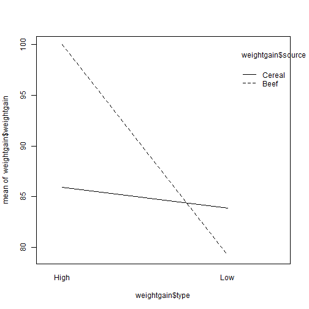
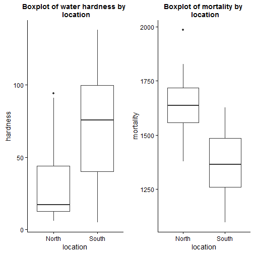
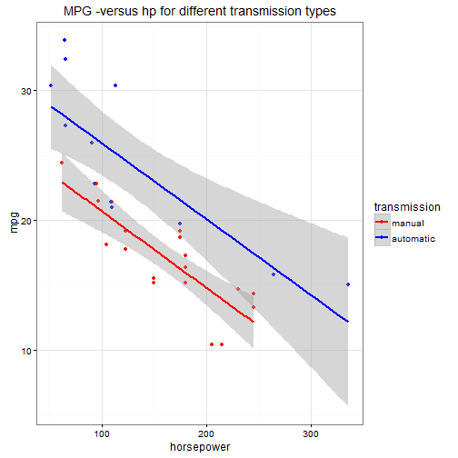
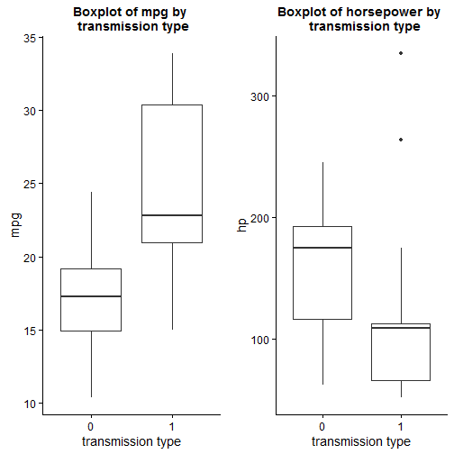

## Introduction  

* Talk covers ANOVA (1,2 way), ANCOVA and MANOVA
* It covers the theory and assumptions of techniques, how to specify a model
* How to interpret a model and the output (no p-hacking)
* Their uses, apart from testing the difference in Means, what else can I use these for (validataing k values in k means clustering).
* The need for post hoc testing (Bonferoni correction, Tukey HSD)? 
* The last two points will be covered in a different talk.
* Code is written in R but equivalent code can be got here for python : http://brennap3.tumblr.com/post/139323592247/week-1-anova-testing?is_related_post=1


---
## Reources
* A handbook of statistical analysis using R

---
## Anova an Introduction

* We will start off with a brief explanation of one-way ANOVA. A hypotheis test used to test difference in means between groups.
* An ANOVA hypothesis tests the difference in population means based on one characteristic or factor.
* What we mean by one-way is that only one factor is influencing the population means.
* Specifiying the model, this technique can be used in situations where the groups you are testing independent and random, the distribution of data are normal and populations of the different groups have similar variance.
* As with any hypothesis test we state a null hypothesis and an alternative hypothesis: (H0) the means are equal (the null hypothesis) and (Ha) the means are not equal.

---
## Anova How it works? 
* To figure out if there is a distinction in the means between group or whether the difference is due to some kind of random variation, we can perform ANOVA. ANOVA examines both the variations of data within group and variation between groups.
* Compute the group means and standard deviations.
* Determine the within group variation (MSW, mean square within value, the weighted sum of the variance for the inividual groups).
* Determine the between group variation, (MSB, the mean square between, the variance between the group means)
* Determine the F-statistic using the within and between group variation
* Test the significance of the F-statistic.

---
## Anova How it works? 
* The F-statistic is calculated as the ratio of MSB and the MSW
* To test the significance of the F statistic  that you calculated, you must determine the degree of freedom for the mean square within and mean square between.
* df within is calculated  as N-k where , N is the total numbers of observations, k is the number of groups.
* df between is equal to k-1 where k is the number of groups.
* To test our f statistic we look up the critical (this can be of your choosing 0.05, 0.01, 0.001, 0.1) F statistic value at the calculated df within and df between value. For example if df within was calculated as 3 and df between as 24, and a alpha of 0.05 ( 95th precentile) we would compute this value in R using this code.  
* We then test the critical value for the f-statistic against the observed f-statistic value, if the observed value is greater than the critical value for the f-statisic we reject the null hypothesis.

```r
##f statistic R alpha 0.05 and the relevant degrees of freedom
qf(0.95,3,24)
```

```
## [1] 3.008787
```

---
## ANOVA lets run it in R
* Lets run a an effects plot, the difference in means between beef and cereal is relatively low while for type it is high.
* Lets run an anova test for source and weight gain and source and type. We can see for source we do not reject he null hypothese that there is no difference in means (at 0.1 and 0.05 level)
* For type we do reject the  the null hypothesis there is a difference in means at the (at 0.1 and 0.05) level.

---
## ANOVA results

```r
library(HSAUR2)
```

```
## Warning: package 'HSAUR2' was built under R version 3.3.1
```

```
## Loading required package: tools
```

```r
data("weightgain",package="HSAUR2")

summary(weightgain)
```

```
##     source     type      weightgain    
##  Beef  :20   High:20   Min.   : 51.00  
##  Cereal:20   Low :20   1st Qu.: 75.50  
##                        Median : 88.50  
##                        Mean   : 87.25  
##                        3rd Qu.: 98.00  
##                        Max.   :118.00
```

---
## ANOVA results: Means by source and type

```r
tapply(weightgain$weightgain,list(weightgain$source,weightgain$type),mean) #calculate
```

```
##         High  Low
## Beef   100.0 79.2
## Cereal  85.9 83.9
```

---
## ANOVA results: Effects plot

```r
plot.design(weightgain) ##Plot Univariate Effects of a Design or Model
```


---
## ANOVA results: ANOVA test weightgain source

```r
anova(lm(weightgain~C(source),data=weightgain)) 
```

---
## ANOVA results: ANOVA test weightgain source

```
## Analysis of Variance Table
## 
## Response: weightgain
##           Df  Sum Sq Mean Sq F value Pr(>F)
## C(source)  1   220.9  220.90  0.8203 0.3708
## Residuals 38 10232.6  269.28
```


---
## ANOVA results: ANOVA test weightgain type

```r
anova(lm(weightgain~C(type),data=weightgain))
```

---
## ANOVA results: ANOVA test weightgain type

```
## Analysis of Variance Table
## 
## Response: weightgain
##           Df Sum Sq Mean Sq F value  Pr(>F)  
## C(type)    1 1299.6 1299.60  5.3949 0.02565 *
## Residuals 38 9153.9  240.89                  
## ---
## Signif. codes:  0 '***' 0.001 '**' 0.01 '*' 0.05 '.' 0.1 ' ' 1
```

---
## Two way ANOVA
* The two-way ANOVA analyzes the divergence in mean  between groups that have been divided on two factors. 
* The main goal of a two-way ANOVA is to identify if there is an interaction amongst both independent variables on the dependent variable

---
## Interaction plot - Code
* There appears to be an interaction between source type and type weightgain.

```r
interaction.plot(weightgain$type,weightgain$source,weightgain$weightgain)
```

---
## Interaction plot - Plot
* There appears to be an interaction between source type and type weightgain. Lets quantify it.


---
## Check for an interaction
* There appears to be an interaction between source and type (this is because the interaction p value is approaching significance at 0.05 level) as the use of low protein serial diets leads to higher weightgains than low protein beef diets. This is also seen in our interaction plot.

```r
anova(lm(weightgain~C(type)*C(source),data=weightgain))
```

```
## Analysis of Variance Table
## 
## Response: weightgain
##                   Df Sum Sq Mean Sq F value  Pr(>F)  
## C(type)            1 1299.6 1299.60  5.8123 0.02114 *
## C(source)          1  220.9  220.90  0.9879 0.32688  
## C(type):C(source)  1  883.6  883.60  3.9518 0.05447 .
## Residuals         36 8049.4  223.59                  
## ---
## Signif. codes:  0 '***' 0.001 '**' 0.01 '*' 0.05 '.' 0.1 ' ' 1
```

---
## MANOVA
* For Manova our test statistic is <math xmlns="http://www.w3.org/1998/Math/MathML"><mi>&#x39B;</mi></math> and is calculated as

<math xmlns="http://www.w3.org/1998/Math/MathML"><mi>&#x39B;</mi><mo>=</mo><mfrac><mfenced open="|" close="|"><mi>W</mi></mfenced><mfenced open="|" close="|"><mi>T</mi></mfenced></mfrac><mo>=</mo><mfrac><mfenced open="|" close="|"><mi>W</mi></mfenced><mfenced open="|" close="|"><mrow><mi>B</mi><mo>+</mo><mi>W</mi></mrow></mfenced></mfrac></math>

* W and t are determinant of the within and total sum of squares and cross-product matrix

* So the test statistic is the ratio of determinants of the matrix that represents error, compared with the sum of the matrices that provide information about "effect plus error" in the denominator.

* Wilks lambda is the estimate of the proportion of variance in an outcome variable scores that is not predictable from group membership.

---
## MANOVA - R Code

* One way MANOVA in R

```r
##slide MANOVA
data("water",package="HSAUR2")
#summary(water)
##one way MANOVA
summary(manova(cbind(hardness,mortality)~C(location),data=water),test="Wilks")
##other test statistics
##summary(manova(cbind(hardness,mortality)~C(location),data=water),test="Roy")
##summary(manova(cbind(hardness,mortality)~C(location),data=water),test="Hotelling-Lawley")
##summary(manova(cbind(hardness,mortality)~C(location),data=water),test="Pillai")
```

---
## MANOVA - R Code output

* One way MANOVA in R

```
##             Df   Wilks approx F num Df den Df    Pr(>F)    
## C(location)  1 0.52626   26.106      2     58 8.217e-09 ***
## Residuals   59                                             
## ---
## Signif. codes:  0 '***' 0.001 '**' 0.01 '*' 0.05 '.' 0.1 ' ' 1
```

---
## MANOVA - Check the ouput with a faceted boxplot

```r
library(cowplot)
library(ggplot2)
ap<-ggplot(water, aes(x=as.factor(location), y=hardness)) + geom_boxplot() + ggtitle("Boxplot of water hardness by location")
bp<-ggplot(water, aes(x=as.factor(location), y=mortality)) + geom_boxplot() + ggtitle("Boxplot of mortality by location")

plot_grid(ap, bp, ncol = 2, nrow = 1)
```

---
## MANOVA - Check the ouput with a faceted boxplot



---
## MANOVA - Final Notes
* Tests multiple  variables by factor
* By one factor is one way MANOVA
* By two factors is two way MANOVA
* If your doing this apart from certain uses cases use a bloody model
* Can use lm also to do MANOVA

---
## MANOVA - Assumptions
* This is problematic and you need to check if your data can be analyzed using MANOVA, MANOVA makes the following assumptions
* Your two or more dependent variables should be measured at the interval or ratio level (i.e., they are continuous). 
* Your independent variable should consist of two or more categorical, independent groups
* You should have independence of observations, which means that there is no relationship between the observations in each group or between the groups themselves.
*  large sample size.
* No outliers
* Multivariate normality
* linear relationship between each pair of dependent variables for each group of the independent variable.
* Homogeneity of variance-covariance matrices.
* No eveidence multicollinearity.


---
## ANCOVA

* ANOVA can be extended to add one or more continuous variables that help predict the dependent variable, while these varaible are not directly part of the experimental manipulation they do have an influence on the dependet variable and are sometimes referred to as covariates. They can also be included in the experiment.
* Including covariates in ANOVA serves two purposes; 
* (1) It reduces within-group error variance, as ANOVA assess the effect of the epxeriment by contrasting the amount of variablity in the data that the experiment can explain against the variability that we cannot explain. By adding covariates we can take account of some of the previously unidentified variance in terms of covariates, thereby helping minimize the error variance, this allows us to better measure the effect of the experimentally controlled variable (the varaible being manipulated in an experiment).
* (2) Elimination of confounding variables. Confounding variables are vaiables that varies systematically with the variable being experimentally controlled. If variables  are observed to influence the dependent variable, then ANCOVA is extremely useful to take accout of the bias of these confounding variables.Upon classification of a variable as been a confound, it can be measured and added  and taken account of  
in our analysis.

---
## ANCOVA specification
* ANCOVA makes the same assumptions as any linear model with two additional criteria:
* Independence of the covariate with the depdendent variable, i.e the covariate should not be different accross the different groups.
* Homogenity of regession lines, i.e if you plot the scatterplot the regression line for each should be the same for the different groups.


---
## ANCOVA in R - Code


```r
data("mtcars",package="datasets")
##Build aModel with interaction between categorical variable and predictor variable
##result <- aov(mpg~hp*am,data = mtcars)
##print(summary(result)) ##hp:am interaction does not seem  important
##Model without interaction between categorical variable and predictor variable
##result <- aov(mpg~hp+am,data = mtcars)
##print(summary(result))
##comparing the two models
result1 <- aov(mpg~hp*am,data = mtcars)
result2 <- aov(mpg~hp+am,data = mtcars)
# Compare the two models.
print(anova(result1,result2))##mileage will depend on horsepower in a similar manner whether or not the car is auto of manual transmission
```

---
## ANCOVA in R - Code Evaluated


```
## Analysis of Variance Table
## 
## Model 1: mpg ~ hp * am
## Model 2: mpg ~ hp + am
##   Res.Df    RSS Df  Sum of Sq     F Pr(>F)
## 1     28 245.43                           
## 2     29 245.44 -1 -0.0052515 6e-04 0.9806
```

---
## ANCOVA in R - lets plot the data code

```r
mtcarsubset=subset(mtcars,,select=c('mpg','hp','am'))
ggplot(mtcarsubset, aes(x=hp, y=mpg,color=as.factor(am))) +
  geom_point() +
  geom_smooth(method ="lm") +
  coord_cartesian() +
  ggtitle("MPG -versus hp for different transmission types") +
  xlab("horsepower")+
  ylab("mpg")+
  scale_colour_manual(name="transmission",values=c("red","blue"),labels=c("manual","automatic"))+
  theme_bw()
```

---
## ANCOVA in R - lets plot the data -plot



---
## ANCOVA test specification -code

```r
##meets  independence of covariates metrics, hmm not sure
## see below
library(ggplot2)

ggplot(mtcarsubset, aes(x=as.factor(am), y=hp)) + geom_boxplot() + ggtitle("Boxplot of horsepower by  transmission type")+xlab("transmission type")

anova(lm(mpg~(as.factor(am)),data=mtcarsubset))
##does differ
anova(lm(hp~(as.factor(am)),data=mtcarsubset))
##does not differ okay , though outliers are present
```

---
## ANCOVA test specification - results



---
## ANCOVA test specification - results part deux


```
## Analysis of Variance Table
## 
## Response: mpg
##               Df Sum Sq Mean Sq F value   Pr(>F)    
## as.factor(am)  1 405.15  405.15   16.86 0.000285 ***
## Residuals     30 720.90   24.03                     
## ---
## Signif. codes:  0 '***' 0.001 '**' 0.01 '*' 0.05 '.' 0.1 ' ' 1
```

```
## Analysis of Variance Table
## 
## Response: hp
##               Df Sum Sq Mean Sq F value Pr(>F)
## as.factor(am)  1   8619  8619.5   1.886 0.1798
## Residuals     30 137107  4570.2
```
