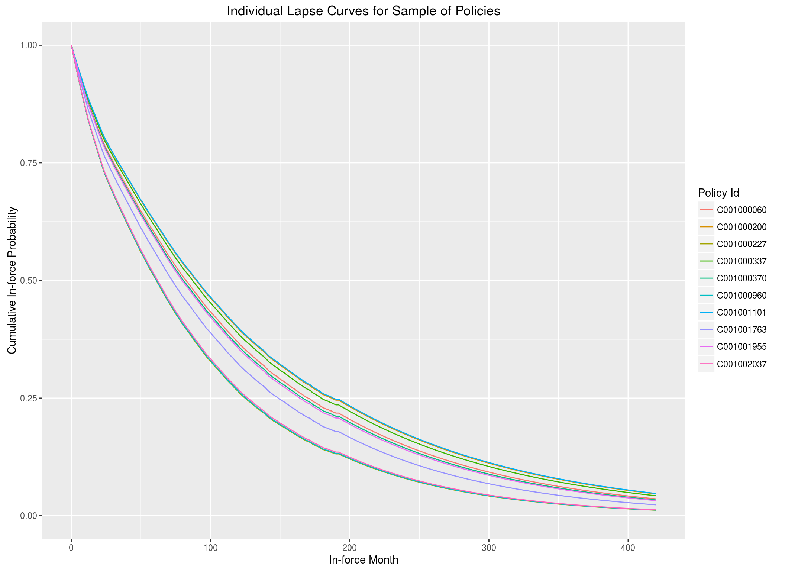

<!--
(Title:) Doing Survival Analysis in R

Author: Mick Cooney

Date: June 2016

Abstract: This Rmarkdown document provides some basic introductory survival analysis in R.

Keywords: survival analysis, intro

-->

```{r knit_opts, include=FALSE}
rm(list = ls())

knitr::opts_chunk$set(
    tidy       = FALSE
   ,cache      = FALSE
   ,fig.width  = 11
   ,fig.height =  7
)

library(tidyverse)
library(data.table)
library(dtplyr)

library(survival)
library(survminer)

library(cowplot)

theme_set(theme_grey())

options(width = 80)
```

Time-to-event Modelling

\

Wide variety of applications

\

Started in medical statistics


## Basic Concepts

Survival function

$$
S(t) = P(T > t)
$$

\

Hazard function

$$
S(t) = e^{- \int^t_0 \lambda(\tau) \, d\tau }
$$

\

Cumulative hazard

$$
\Lambda(t) = \int^t_0 \lambda(\tau) \, d\tau
\implies
S(t) = e^{-\Lambda(t)}
$$


---

Decreasing Hazard Function

```{r hazard_function_decr_illustration, echo=FALSE}
time <- 1:120

hazard_first <- 0.05 + ((0.01 - 0.05) / (3 * 12)) * 1:36
hazard_after <- rep(0.01, 7 * 12)

hazard_vals_decr <- c(hazard_first, hazard_after)
surv_vals_decr   <- cumprod(c(1, 1 - hazard_vals_decr))


surv_plot_decr <- ggplot() +
    geom_line(aes(x = c(0, time), y = surv_vals_decr)) +
    expand_limits(y = 0) +
    xlab("Time") +
    ylab("Cumulative Survival")

hazard_plot_decr <- ggplot() +
    geom_line(aes(x = time, y = hazard_vals_decr)) +
    expand_limits(y = 0) +
    xlab("Time") +
    ylab("Hazard Value")

plot_grid(surv_plot_decr, hazard_plot_decr, nrow = 2)
```

---

Increasing Hazard Function

```{r hazard_function_incr_illustration, echo=FALSE}
time <- 1:120

hazard_first <- 0.01 + ((0.05 - 0.01) / (3 * 12)) * 1:36
hazard_after <- rep(0.05, 7 * 12)

hazard_vals_incr <- c(hazard_first, hazard_after)
surv_vals_incr   <- cumprod(c(1, 1 - hazard_vals_incr))


surv_plot_incr <- ggplot() +
    geom_line(aes(x = c(0, time), y = surv_vals_incr)) +
    expand_limits(y = 0) +
    xlab("Time") +
    ylab("Cumulative Survival")

hazard_plot_incr <- ggplot() +
    geom_line(aes(x = time, y = hazard_vals_incr)) +
    expand_limits(y = 0) +
    xlab("Time") +
    ylab("Hazard Value")

plot_grid(surv_plot_incr, hazard_plot_incr, nrow = 2)
```

---

```{r incr_decr_surv_comparison, echo=FALSE}
ggplot() +
    geom_line(aes(x = c(0, time), y = surv_vals_incr), colour = 'red') +
    geom_line(aes(x = c(0, time), y = surv_vals_decr), colour = 'blue') +
    expand_limits(y = 0) +
    xlab("Time") +
    ylab("Cumulative Survival") +
    ggtitle("Comparison of Survival Curves")
```


## Censoring and Truncation

\

Times often *censored*.

\

Right-censoring very common.

\

Related concept of *truncation*


## Survival Data

\

`leukemia` dataset in R:

\

```{r leukemia_data, echo=FALSE}
head(leukemia, n = 10)

with(leukemia, Surv(time, status))
```

## Kaplan-Meier Estimate

```{r kaplan_meier_estimate, echo=FALSE}
ggsurvplot(survfit(Surv(time, status) ~ 1, data = leukemia)
          ,censor = TRUE
          ,break.time.by = 10)
```

---

```{r kaplan_meier_estimate_strata, echo=FALSE}
ggsurvplot(survfit(Surv(time, status) ~ x, data = leukemia)
          ,censor = TRUE
          ,break.time.by = 10)
```

## Cox Proportional Hazards

\

$$
\lambda(t | \mathbf{X}) = \lambda_0(t) \exp(\beta \mathbf{X})
$$

\

$\lambda_0(t)$ is the *baseline hazard rate*

\

Time-invariant multiplicative effect


---

```{r coxph_model, echo=TRUE}
model_coxph <- coxph(Surv(time,status) ~ x
                    ,data = leukemia)

summary(model_coxph)
```

---

```{r coxph_model_baseline, echo=FALSE}
ggsurvplot(survfit(model_coxph), censor = FALSE)
```

## More Complex Data

\

```{r sample_data_example, echo=FALSE}
data_dt <- feather::read_feather("sample_data.feather") %>%
    select(health, gender, age_at_start, time, fail)

head(data_dt, n = 10)
```

---

```{r survival_km_nosplit, echo=FALSE, fig.height=10, fig.width=14}
nosplit_km <- survfit(Surv(time,fail) ~ 1, data = data_dt)
plot_1     <- ggsurvplot(nosplit_km, censor = FALSE, size = 0.5, break.time.by = 12)

gender_km <- survfit(Surv(time,fail) ~ gender, data = data_dt)
plot_2    <- ggsurvplot(gender_km, censor = FALSE, size = 0.5, break.time.by = 12)

health_km <- survfit(Surv(time,fail) ~ health, data = data_dt)
plot_3    <- ggsurvplot(health_km, censor = FALSE, size = 0.5, break.time.by = 12)

both_km <- survfit(Surv(time,fail) ~ gender + health, data = data_dt)
plot_4  <- ggsurvplot(both_km, censor = FALSE, size = 0.5, break.time.by = 12)


plot_grid(plot_1$plot, plot_2$plot, plot_3$plot, plot_4$plot, ncol = 2)
```

---


```{r complex_model_coxph, echo=TRUE}
complex_coxph <- coxph(Surv(time,fail) ~ health + gender + age_at_start
                      ,data = data_dt)

summary(complex_coxph)
```

---

```{r complex_model_coxph_plot, echo=FALSE}
ggsurvplot(survfit(complex_coxph), censor = FALSE, break.time.by = 12)
```

---

```{r complex_strata_coxph, echo=TRUE}
complex_strata_coxph <- coxph(Surv(time,fail) ~ strata(gender) + health +
                                                age_at_start
                             ,data = data_dt)

summary(complex_strata_coxph)
```

---

```{r complex_strata_coxph_plot, echo=FALSE}
ggsurvplot(survfit(complex_strata_coxph), censor = FALSE, break.time.by = 12)
```

---


